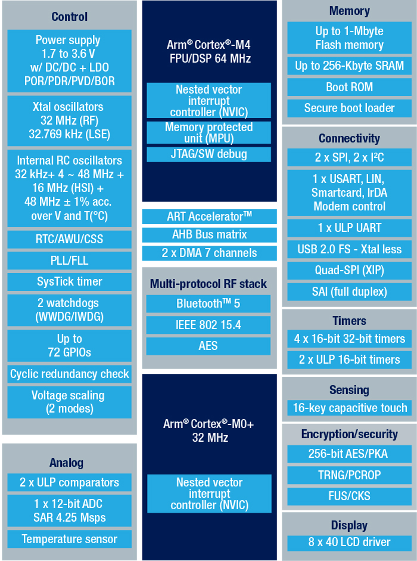

# [STM32WB55](https://github.com/SoCXin/STM32WB55)

* [ST](https://www.st.com/zh/)：[Cortex-M4 + Cortex-M0](https://github.com/SoCXin/Cortex)
* [L3R6](https://github.com/SoCXin/Level) ：64MHz x 1.25 DMIPS/MHz + 32MHz x 0.95 DMIPS/MHz

## [简介](https://github.com/SoCXin/STM32WB55/wiki)

[STM32WB55](https://github.com/SoCXin/STM32WB55) 支持单独或并发运行的Bluetooth® LE 5.0和IEEE 802.15.4通信协议、 Zigbee®和Thread。STM32WB系列具有广泛且易于使用的生态系统，提供经过认证的免费无线电堆栈。

### 关键特性

* BLE 5.2
* USB FS

#### 封装规格

* UFQFPN48（7x7mm）
* VFQFPN68（8x8mm）

### [资源收录](https://github.com/SoCXin/STM32WB55)

* [参考文档](docs/)
* [参考资源](src/)
* [参考工程](project/)

### [选型建议](https://github.com/SoCXin)

[STM32WB55](https://github.com/SoCXin/STM32WB55)

### [探索芯世界 www.SoC.xin](http://www.SoC.Xin)
